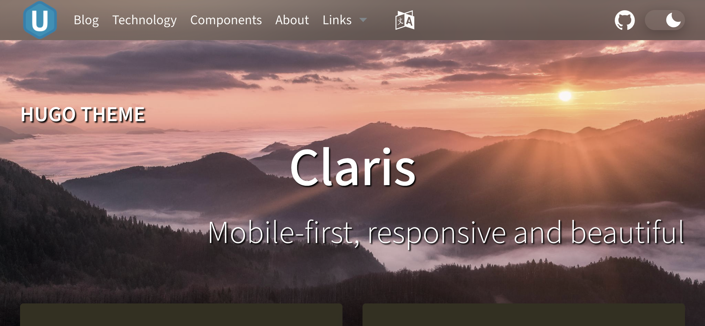
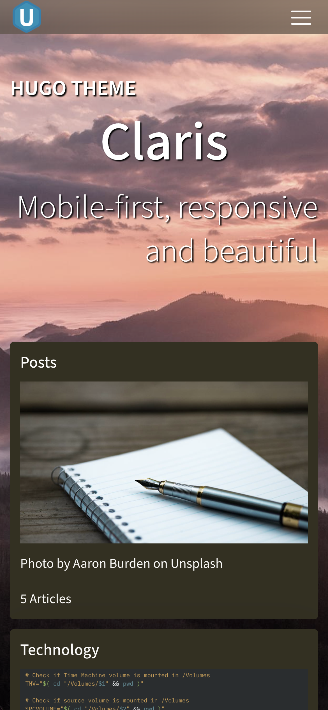
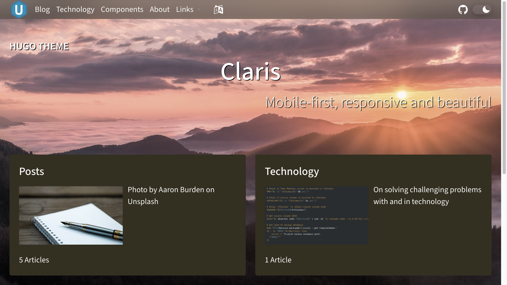
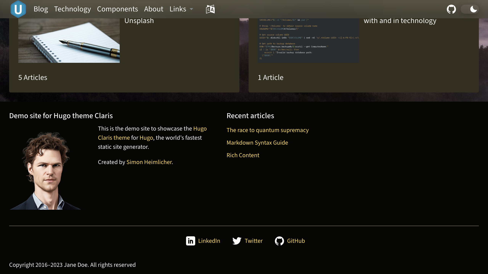

# Hugo Claris — responsive, modular, modern

 

### View [*Demo of Hugo Claris*](https://simonheimlicher.github.io/hugo-claris-demo/)

 &middot;
 &middot;
 &middot;
 &middot;

*Claris* is a theme for [Hugo](https://gohugo.io/), the world’s fastest static website generator

* **Mobile-first:** *Claris* works great on mobile devices as well as on laptops, iMacs, and desktop PCs
* **Responsive:** Adapts its layout and design to the device and orientation of the user
* **Modular:** Implemented as a Hugo module, which is just a Go module

## Responsive

### Mobile

**iPhone 12 Pro (390x844px)**

### Desktop

**WXGA 1280x720px**

## Installation

You can use *Claris* as a `Hugo module` using the identifier `github.com/simonheimlicher/hugo-claris`, or use it as a `Hugo theme` by [cloning its Github repository](https://github.com/simonheimlicher/hugo-claris/).

## Contributing

The main purpose of this repository is to continue to evolve *Claris* core, making it faster and easier to use. Development of *Claris* happens in the open on GitHub, and we are grateful to the community for contributing bugfixes and improvements. Read below to learn how you can take part in improving *Claris*.

### [Code of Conduct](./CODE_OF_CONDUCT.md)

We have adopted a Code of Conduct that we expect project participants to adhere to.
Please read [the full text](./CODE_OF_CONDUCT.md) so that you can understand what actions will and will not be tolerated.

### [Contributing Guide](./CONTRIBUTE.md)

Read our [contributing guide](./CONTRIBUTE.md) to learn about our development
process, how to propose bugfixes and improvements, and how to build and test
your changes to *Claris*.

### License

Hugo Claris is [MIT licensed](./LICENSE).
